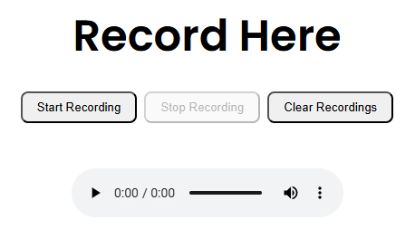
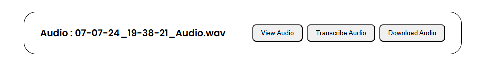

## Automatic To-Do-List Generator Web App

This project aims to create a web application using Flask that automates the process of generating to-do lists from recorded audio.
It leverages various technologies to achieve this, including Record-RTC for audio recording within the browser, openai-whisper for audio transcription using Python, and LLama3 NLP model for generating actionable to-do items. The app further integrates with third-party productivity tools like Google Calendar or Notion to set calendar events based on generated tasks.

#### Features:
- **Audio Recording**: Record audio directly within the browser using Record-RTC library.
- **Transcription**: Transcribe recorded audio into text using openai-whisper library.
- **Task Generation**: Use LLama3 NLP model to convert transcriptions into actionable to-do items.
- **Integration**: Connect with external productivity applications (e.g., Google Calendar, Notion) to set reminders based on generated tasks.

#### Project Status:
This project is currently a Proof of Concept and requires extensive refinement and development to enhance functionality, reliability, and user experience.

#### Demonstration:
To run the web app locally, follow these steps:
1. Run this line to install requirements in your venv or conda env: `python -m pip install -r requirements.txt`
2. Start the flask app: `python app.py`
3. <strong>Start Recording</strong>: Begins the audio recording  
    <strong>Stop Recording</strong>: Stops the current audio recording  
    <strong>Clear Recordings</strong>: Clears all current recordings stored in the local session

 

4. The saved audio recordings will be listed in the box below 
 
